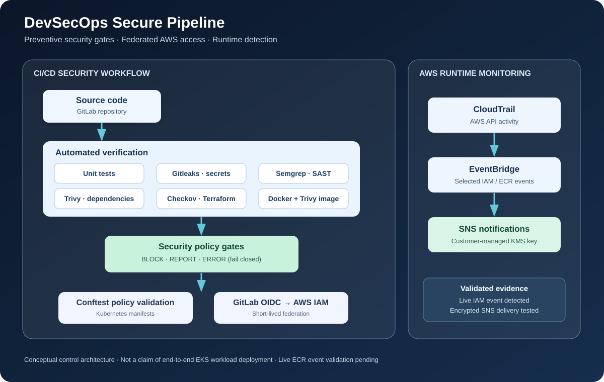
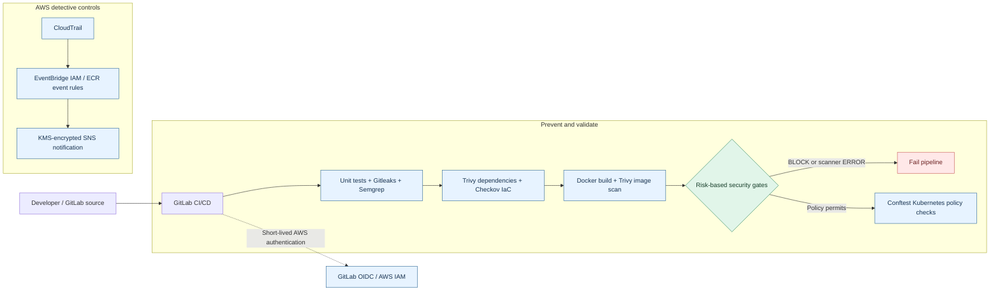
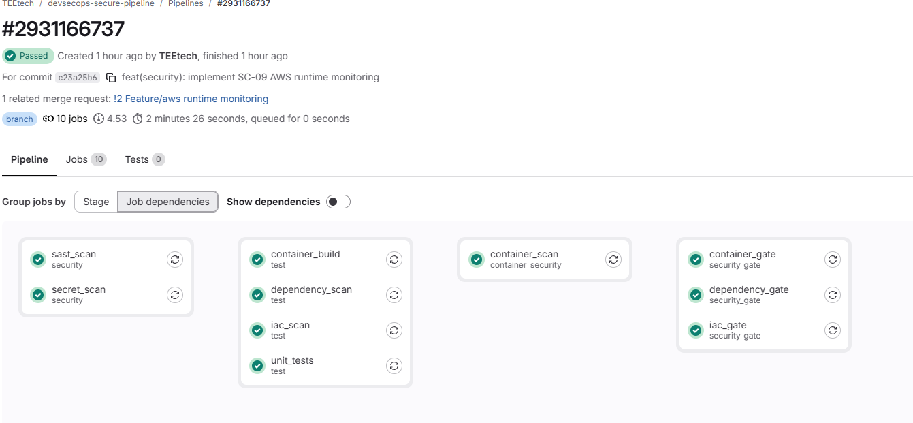

# DevSecOps Secure Pipeline

**Engineering security into software delivery, from source code to AWS runtime monitoring.**

A cloud security engineering portfolio project demonstrating how automated controls detect vulnerabilities, enforce risk-based security policies, and monitor security-sensitive AWS activity.

**Phase 1: Complete (October 2026)**

| 9 security controls | 76 local Python tests passed | GitLab `main` pipeline passed | 0 blocking IaC findings |
|:--:|:--:|:--:|:--:|

> **In plain language:** This project demonstrates how to check software and infrastructure for security problems *before* delivery, and how to detect selected suspicious changes in AWS afterward.

## Architecture at a glance

**Reading the diagram:** The left side shows preventive checks and security gates. The right side shows detective monitoring in AWS. These are implemented capabilities, **not** a claim that a complete application was continuously deployed to Amazon EKS.

<strong>View editable architecture flow (Mermaid)</strong>

## Evidence: Successful GitLab security pipeline

*Screenshot: GitLab pipeline **#2931166737**, SC-09 feature branch, 10 successful jobs. This is feature-branch evidence; the separate post-merge `main` pipeline was also confirmed passed. GitLab's “Tests 0” means test reports were not published to its Tests interface; the 76 passing Python tests were verified locally.*

## Why this project matters

Software delivery can introduce risk through application code, exposed secrets, vulnerable dependencies, insecure infrastructure, container images, and overly permissive access. Security controls integrated into CI/CD can surface these risks early and stop unacceptable findings from progressing. Monitoring complements prevention by identifying selected security-sensitive activity in AWS.

## Implemented security controls

| Control | Technology | What it demonstrates |
|---|---|---|
| SC-01 | Gitleaks | Detects secrets in source code |
| SC-02 | Semgrep | Finds insecure code patterns |
| SC-03 | Trivy | Evaluates dependency vulnerabilities |
| SC-04 | Checkov | Enforces Terraform security policy |
| SC-05 | Docker + Trivy | Builds and scans container images |
| SC-06 | GitLab OIDC + AWS IAM | Uses short-lived federated credentials |
| SC-07 | Conftest | Evaluates Kubernetes deployment policy |
| SC-08 | GitLab protected workflow | Applies controlled integration practices |
| SC-09 | CloudTrail + EventBridge + SNS + KMS | Detects selected AWS changes and routes encrypted alerts |

See [security controls and validation evidence](docs/security-controls.md).

## Engineering decisions

**Fail-closed scanning.** The custom [security reporter](scripts/security_report.py) differentiates clean scans (`0`), blocking findings (`1`), and scanner/report-processing errors (`2`). A broken scanner must not be mistaken for a passing security check.

**Risk-based enforcement.** Findings are categorized as blocking or report-only under documented policy. Resource-specific Checkov exceptions are scoped to justified cases rather than suppressing entire categories of findings.

**Short-lived cloud access.** GitLab OIDC federation avoids storing long-lived AWS access keys in CI/CD.

**Defense in depth.** Preventive pipeline controls are complemented by AWS detective monitoring; neither is represented as a complete substitute for the other.

## Validation summary

- **76 Python tests passed locally**.
- **Post-merge GitLab `main` pipeline passed**.
- **Zero Checkov BLOCK findings**; **12 REPORT findings** remain documented.
- A **live IAM trust-policy update** was detected by the AWS monitoring workflow.
- A **controlled EventBridge event** reached KMS-encrypted SNS notification delivery.
- **Live ECR event detection remains to be validated end to end**.

## Scope and limitations

This is a portfolio/lab implementation, not a production-certified platform. A full continuous EKS application deployment has not been established by the Phase 1 validation evidence. Additional hardening opportunities include CloudTrail and S3 encryption/logging improvements, resilience, and further runtime validation. Accepted risks are documented rather than hidden.

## Explore the repository

| Path | Contents |
|---|---|
| [`.gitlab-ci.yml`](.gitlab-ci.yml) | CI/CD jobs and security stages |
| [`application/`](application/) | Flask application and container configuration |
| [`terraform/`](terraform/) | AWS infrastructure as code |
| [`scripts/security_report.py`](scripts/security_report.py) | Security policy enforcement logic |
| [`tests/`](tests/) | Automated tests |
| [`docs/architecture.md`](docs/architecture.md) | Detailed architecture |
| [`docs/security-controls.md`](docs/security-controls.md) | Controls, evidence and residual risks |
| [`docs/threat-model.md`](docs/threat-model.md) | Threat model |
| [`AGENTS.md`](AGENTS.md) | Repository engineering standards |

---

**Takeaway:** A green pipeline is useful. A pipeline whose security decisions can be explained, tested, and defended is better.
